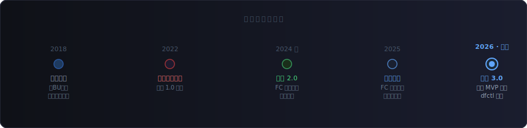
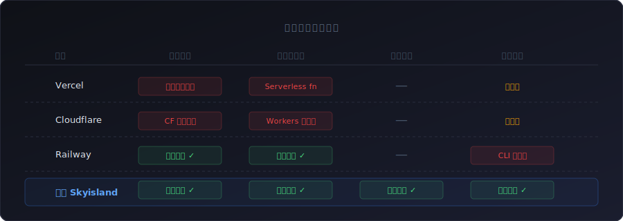
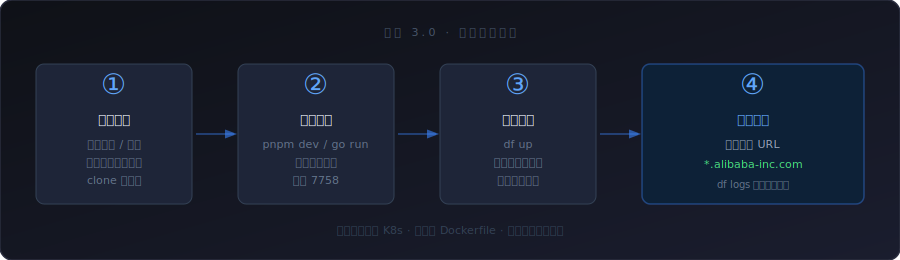
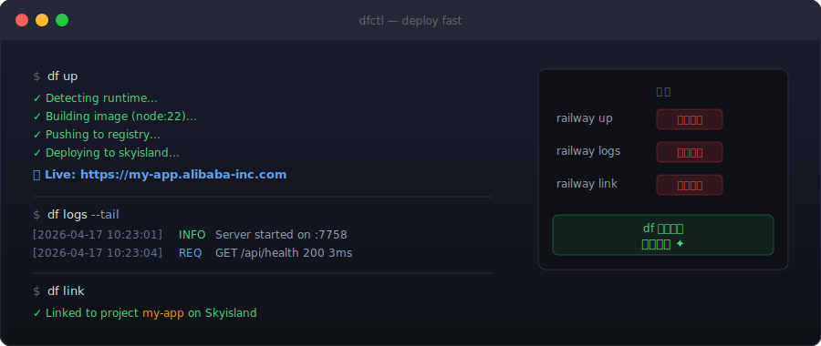

# 一切的开始
*从零到平台：一次内部研发基础设施的重构叙事*

> 本系列文章面向集团内部前后端业务同学，用尽量通俗的方式，讲清楚空岛云平台从哪里来、要解决什么问题，以及基础设施这一层这几年在发生什么。

---

## 一个没人注意到的故障

2024 年初，我刚入职不久，参与国际酒店供应链项目。某天业务方找过来，说接口一直超时，已经异常好几天了。

排查下来，问题出在函数计算 FC 的 Runtime 层。内部定制的框架 Runtime 和平台层 API 的桥接存在缺陷，导致健康检查本该判定为异常的机器，并没有被摘掉流量。正常请求持续被调度到有问题的实例上，业务就这样悄悄烂了好几天。

真正让我在意的，不是这个 bug 本身，而是它被发现的方式——是业务方来反馈的，不是平台告警出来的。FC 提供的监控能力非常有限，大多数前端同学根本不知道平台层出了问题，只能等到用户投诉或者业务数据异常，才能倒推回来。

与此同时还有另一类更日常的困扰：有同学想在函数平台上跑一个依赖浏览器环境的任务，安装 napi 相关的包时反复报错；引导他去用 Aone 发布平台，看了一眼界面就放弃了。Aone 对前端同学的上手成本实在不低，对业务后端来说也好不了多少，大多数人只会点那几个固定的流程按钮，真遇到问题，同样是捉瞎。

我当时就在想：内外部工具的差距，不是一点半点。

---

## 函数计算走到今天

函数计算的理念在 2018、2019 年前后是真正热过一阵的。那时候集团内部跨 BU 的前端先辈们做技术共建，产出了"天空之城"系列，核心目标是推动大家用 Serverless 技术降低服务部署的门槛。**空岛这个名字，就是那时候留下来的。**

但函数计算这条路走着走着，积累的问题越来越多。

函数的限制本身就不少：执行时长有上限，长连接的稳定性一直是痛点，弹性扩缩容的耗时在延迟敏感的场景下很难接受。这两年 AI 的发展推动了函数平台做了一些演进，但这几个核心约束并没有根本性地改变。加上维护团队重心的变化，平台的迭代和问题响应都慢下来了。

2022 年，集团基础设施合并，最初那版空岛走到了终点。



---

## 外面的世界在发生什么

如果你关注过外部的部署平台，可能第一个想到的是 Vercel 或者 Cloudflare——它们足够知名，体验也好。但本质上都有平台绑定属性：Vercel 绑定了自家的边缘节点和 serverless 运行时；Cloudflare 一旦用上 Workers、D1、KV 这套，就深度绑在 CF 的边缘网络里，迁移成本不低。最近尤雨溪的团队也在做类似的事，基于 CF Workers 构建了一个类 Vercel 的部署层，方向是对的，但底层还是站在 CF 的基础设施上。

真正让我持续关注的是 Railway 和 Fly.io，原因正好相反：**它们是平台无关的。** 你的应用是什么就是什么，平台只负责把它跑起来，不试图介入你的技术选型。

它们做到的一件事是：把所有的复杂度挡在开发者看不到的地方。你不需要知道容器是什么，不需要写 Dockerfile，不需要理解 K8s 的调度逻辑。推代码，服务就起来了。



空岛选择了同样的方向——不捆绑任何云厂商的运行时。这在商业上意味着壁垒很低，用户随时可以走。但我们想清楚了：核心用户是内部，这个逻辑本身就不一样。我自己用 Railway 每个月要付几百块钱，在内部建这么一个平台，公司付钱，自己免费部署，这笔账怎么算都划算。更何况内部还有那么多前端同学面临同样的问题。

---

## 空岛 2.0：从监控开始

2024 年底，我决定重启空岛这个品牌，做一件更小但更实际的事：**给 FC 补上它一直缺失的监控和问题排查能力。**

不是要替代什么，就是把开发者在排查问题时最需要、FC 平台又一直没提供好的那部分能力，先做出来。这是空岛 2.0 的起点。

2025 年，情况发生了变化。FC 明确宣布不再维护，业务需要迁移。集团内部有另一个团队接手做了兼容平台，但做平台这件事需要相当的专业度，不是有人力投入就能做好的。

这一年我花了很多时间和集团内部多个基础团队沟通，建立信任，确认资源边界。不是为了证明什么，是因为我知道：如果这些关系和资源没有到位，平台根本立不起来。在前端团队做基础设施这件事，有天然的组织摩擦，但另一面是，正因为在业务侧待过，我比纯基础设施团队更清楚开发者真正卡在哪里。

---

## 空岛 3.0：这个月

2026 年初，空岛平台正式对内可用，先上线了函数平台的监控告警核心能力。

而就在这个月底，空岛 3.0 正式发布：**MVP 页面上线，dfctl CLI 同步发布。**

### 页面操作：足够简单

用户进入平台，创建应用，平台自动生成对应语言的仓库代码模板；clone 到本地，本地开发完成后，点击部署按钮，等待构建完成，拿到可访问的 URL。

整个流程不需要理解 K8s，不需要写 Dockerfile，不需要申请机器资源。这是我们对"足够简单"的定义。



### dfctl：你的部署命令行

dfctl，deploy fast，对标 Railway CLI，核心命令三个：

```bash
# 部署当前项目
df up

# 实时查看日志
df logs

# 关联已有项目
df link
```

用过 `gh`、用过 `railway` 的同学应该很熟悉这个体感。最大的区别只有一个：**这些命令，在空岛上全部免费。**



平台目前支持 **Rust、Go、Node.js、Python** 四大语言，以及通过自定义 Dockerfile 的其他小众语言部署。Java 由于天然对单机资源的诉求更大，暂时不在支持范围内。

遵循约定大于配置——默认情况下你只需要按各语言的最佳实践写代码，平台自动完成构建和部署。如果有特殊需求，在项目根目录放一个配置文件即可覆盖默认行为：

- `dnf.toml` — 对应集团内网部署，域名 `dnf.alibaba-inc.com`
- `df.toml` — 对应社区部署，域名 `df.longye.site`（暂定）

两个配置文件，对应两套环境，dfctl 会自动识别。

**一个提醒：纯前端项目不建议部署到空岛。** 静态资源套一个 server 跑在容器里，是容器成本的巨大浪费。纯前端工具或网页，建议走集团 Pages 服务，或者各 BU 基于空岛云 + OSS 自行部署静态资源托管。后者我们未来也会在平台层直接提供支持。

### 为什么叫 dnf？

这个名字有点来历。一方面是被某款游戏荼毒多年，另一方面是当时内部这个域名没有被占用。最初我关注的是 Node.js 的部署问题，所以就叫了 **deploy node.js fast**，缩写 dnf。

后来 AI 来临，多语言之间的工程壁垒被打平，平台从单语言扩展到多语言变得非常快。语言限制去掉了，名字也该跟着变。

但真正让 dnf 这个命令名退场的，是另一个原因：debian 和 ubuntu 系列系统里，`dnf` 是包管理器的命令，跨平台使用会直接冲突。这个问题 4 月初准备发布时才想起来，当时已经做得差不多了，某天突然意识到这件事，当天就把命令名改掉了。

于是 dnf 变成了 **dfctl**，deploy fast，命令用 `df`。名字短了，但意思更准了。

---

## 接下来

这个系列打算把这几年遇到的问题一篇一篇写下来：

- **Pouch 的问题在哪里** — 容器运行时这一层，内部和社区的差距在哪
- **神坛跌落的函数计算** — FaaS 的边界，以及为什么它解决不了所有问题
- **回到前端基建神器 Node.js** — Node 在工程化体系里的核心地位
- **新一代前端基建神器 Rust** — 为什么越来越多的前端工具在用 Rust 重写
- **业务全球化之路道阻且长** — 把服务部署到全球有多难
- **CLI 工具分发这件事，我们想清楚了** — df 子命令动态加载背后的工程决策
- **从 Swagger 到 MCP** — 服务端同学不需要关心的那一层
- ……

如果你是前后端业务同学，希望这个系列能帮你理解基础设施这一层在发生什么。如果你也在做类似平台的事情，欢迎交流。

空岛现在可以用了，欢迎试试 `df up`。

---

*下一篇：Pouch 的问题在哪里*
