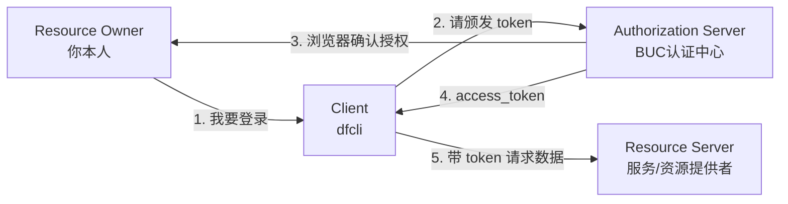
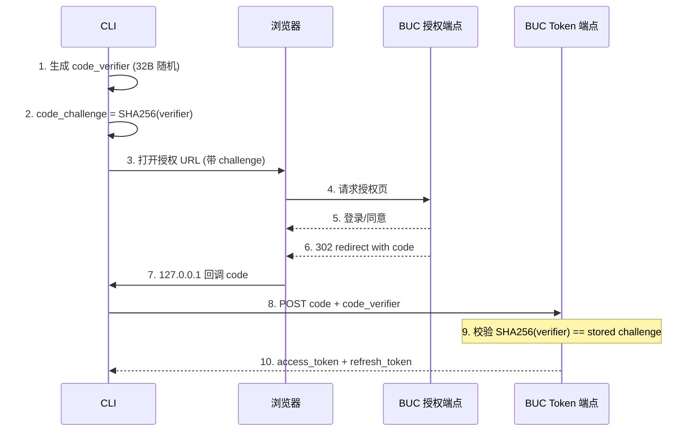

**谁该读**：写过登录功能、没系统学过 OAuth2 的同学；想给 CLI 接 BUC 登录的同学；对"CLI 为什么不写 client_secret"好奇的同学。

**读完能答出**：

1. 四种 Grant Type 为什么长成那样
2. PKCE 堵住了哪一种攻击
3. BUC 和 RFC 标准差在哪
4. 同一套流程 Node / Python / Go / Rust 的 stdlib 表现力差异

---

## OAuth 的本质不是"登录"

OAuth 的目的从来不是登录，而是**把我的某项权限委托给第三方工具，同时不给它看我的密码**。这点不搞清楚，后面所有设计都会走形。

四个角色的关系：



在集团场景里：Resource Owner 是员工，Client 是一堆 `cli` 二进制工具，Authorization Server 是 `login.alibaba-inc.com`，Resource Server 是 HSF 管控台、业务后端服务等。只有 Authorization Server 亲眼看着你输密码——其他角色从头到尾都摸不到你的凭据。

---

## 四种 Grant Type 的选择矩阵

OAuth2 不是一个协议，是**四种协议的打包**：

| Grant Type | 需要真人 | 需要浏览器 | 需要 client_secret | 典型场景 |
|---|:-:|:-:|:-:|---|
| **Authorization Code** | ✓ | ✓ | 可选 | Web、CLI、手机 App |
| Implicit | ✓ | ✓ | ✗ | **已废弃**，token 暴露在 URL |
| Resource Owner Password | ✓ | ✗ | 通常要 | CI、无头脚本 |
| Client Credentials | ✗ | ✗ | **必须** | 后端互调 (M2M) |

CLI 的唯一正解是 **Authorization Code + PKCE**——唯一一个"有真人、能开浏览器、不需要秘密"的模式。

---

## PKCE：一次攻击演练

假设我们只用裸 Authorization Code，不加 PKCE：

```
浏览器 → BUC：  给 dfctl 一个授权码
BUC  → 浏览器： 302 http://127.0.0.1:PORT/callback?code=XXX
浏览器 → CLI：  把 code=XXX 传回来
CLI  → BUC：    POST code=XXX 换 access_token
```

攻击点在第 3 步。`127.0.0.1:PORT/callback` 是**明文 HTTP**。如果本机上另一个恶意进程抢先绑定同一端口，或者嗅探 loopback 流量，就能截到 `code`，抢先 POST 换 token——因为服务端不知道真正的 `dfctl` 长什么样。

PKCE 怎么堵这个口子：



`code_verifier` 只在 CLI 进程**内存**里，从不出现在 URL、不写磁盘、不走浏览器。攻击者即使截到 `code`，没有 verifier 也换不到 token——钥匙和门在物理上分开了。

---

## Public vs Confidential Client

这是决定**要不要申请 client_secret 的唯一问题**：代码跑在哪，决定了能不能保密。


一句话：`dfctl` 是 public client，**没有也不能有**真正的 secret。它的"身份证"叫 `client_id=dfctl`，是**公开信息**，不是凭据。任何人都能用这个 id 跑流程，但只能以**自己的 BUC 身份**登录成功——因为授权那一刻是 BUC 看着你在浏览器里扫码。

---

## BUC 和标准 OAuth 的 6 个差异

BUC 是"看起来像 OAuth2 的私有协议"。用社区标准库直接接大概率翻车。最大的坑是 **UserInfo**：


全量对照表：

| 维度 | RFC 6749 / 7636 / OIDC | BUC |
|---|---|---|
| 授权端点 | `/authorize` | `/oauth2/auth.htm` |
| Token 端点 | `/token` | `/rpc/oauth2/access_token.json` |
| UserInfo | `GET /userinfo` + `Authorization: Bearer` | **`POST` + form body 里 `access_token=...`** |
| 错误字段 | `error`, `error_description` | `error_code`, `error_description` |
| ID Token | OIDC 返回 JWT | ✗ 不返回 |
| Scope | `openid profile email offline_access` 等 | 仅 `profile` |
| SSO Ticket | ✗ | ✓ `/rpc/openapi/generate_ticket.json`，60s 一次性 |
| Discovery | `/.well-known/openid-configuration` | ✗ 端点硬编码 |
| 授权码 TTL | ≤ 10 分钟 | 约 60 秒 |

**能否套用社区 OAuth 库？** 能做 70%（PKCE + authorize + token 换取），但 UserInfo 那步必须自己写 fetch——社区库全部按 OIDC 标准发 `Authorization: Bearer`，BUC 直接返 401。这也是为什么内部不少基础类库接 BUC 会选择**完全手写**。

---

## 8 步流程 + 原子落盘

上文把"为什么"讲透了，下面是实际代码对应的 8 步：

```
Step 1: 生成 PKCE (verifier / challenge / state)
Step 2: 本地起 http://127.0.0.1:<random>/callback
Step 3: 拼授权 URL，带 client_id + redirect_uri + challenge + state
Step 4: 打开浏览器
Step 5: 浏览器走完 BUC SSO，302 回 /callback?code=XXX&state=YYY
Step 6: 校验 state，拿 code + verifier → POST 换 access_token
Step 7: POST access_token → 拿 user_info
Step 8: 原子落盘 ~/.config/mw/auth.yaml (0600 + flock + rename)
```

Step 8 比看起来复杂。`access_token` 是 JWT——**谁能读这个文件，就能冒充你调所有后端 API**。所以必须同时满足：

1. **权限 0600**：只有文件属主能读写（`-rw-------`），防同机其他用户偷看。
2. **flock 互斥**：防两个 `dfctl` 进程同时写造成文件异常和损坏。
3. **tmpfile + rename 原子替换**：POSIX 保证 `rename()` 原子，任何时刻读到的都是完整的旧版本或完整的新版本，永远不会读到半截。

---

## 四语言零依赖实现：stdlib 哲学的差异

我把同一套流程用四门语言各写了一遍，都号称"零依赖"，但"零依赖"的成本各不相同：

| 语言 | 文件 | "零依赖"成本 | 行数 |
|---|---|---|:-:|
| Node.js | `auth.mjs` | ✓ 全部 `node:*` 内置 | ~230 |
| Python | `auth.py` | ✓ 全部 stdlib | ~200 |
| Go | `auth.go` | ✓ `net/http` + `syscall.Flock` | ~260 |
| Rust | `auth.rs` | ⚠ std 无 TLS / SHA256 / base64 / JSON，靠子进程 `curl` / `shasum` | ~380 |

### PKCE 生成，四种写法

```js
// Node.js
const codeVerifier = base64url(crypto.randomBytes(32));
const codeChallenge = base64url(
  crypto.createHash("sha256").update(codeVerifier).digest()
);
```

```python
# Python
verifier = b64url(secrets.token_bytes(32))
challenge = b64url(hashlib.sha256(verifier.encode()).digest())
```

```go
// Go
rand.Read(vb)
verifier := base64.RawURLEncoding.EncodeToString(vb)
sum := sha256.Sum256([]byte(verifier))
challenge := base64.RawURLEncoding.EncodeToString(sum[:])
```

```rust
// Rust (std-only) —— 看起来同样三行，底下藏着 80+ 行手写代码
let verifier = b64url(&rand_bytes(32)?);              // 手写 base64url
let challenge = b64url(&sha256(verifier.as_bytes())?); // SHA256 调 shasum 子进程
```

### 文件锁：最能暴露 stdlib 哲学的一处


Go / Python **两行**搞定，内核负责释放；Node / Rust-std **十几行**，要自己管 stale PID——这不是代码风格问题，是 **stdlib 覆盖 POSIX 系统调用的程度差异**。Rust 生态里你只要 `cargo add fs2` 就能拿到 flock，但说好"零依赖"就得自己扛。

---

## 常见踩坑 Checklist

1. **`invalid_grant`**：code 只能用一次；或 `redirect_uri` 在授权 URL 和换 token 时不没做到一模一样（含 URL 转义）。
2. **`user_info` 返回 401**：99% 是把 `access_token` 放到 `Authorization: Bearer` 里了——集团 BUC 要求放 form body。
3. **state mismatch**：同时开了两个登录流程，浏览器 A 的 state 回调到进程 B。每次登录**独立端口 + 独立 state**。
4. **refresh_token 失效**：BUC **强制轮换**，新 token 不覆盖旧的，下次就废。
5. **SSO Ticket 二次使用**：60 秒一次性，不要缓存。
6. **`auth.yaml` 权限漂移**：手动 `cp` 过来可能变 0644——脚本会自己 chmod，但建议手动 `chmod 600` 一次。
7. **孤儿 `.lock` 文件**（Node/Rust 特有）：进程被 SIGKILL 留下的；下次启动靠应用层自己做 PID 探活清理，探活坏了会永久卡住。
8. **借用别人的 client_id**：技术上能跑，但审计记在别人头上、scope 被别人控制、他们下线你跟着死——务必自己去 BUC 后台注册。

---

## 延伸阅读

- [RFC 7636 - PKCE](https://datatracker.ietf.org/doc/html/rfc7636)
- [RFC 6749 - OAuth 2.0 Authorization Framework](https://datatracker.ietf.org/doc/html/rfc6749)
- [OAuth 2.0 Security Best Current Practice](https://datatracker.ietf.org/doc/html/draft-ietf-oauth-security-topics)（第 2.1 节专讲 public client 为什么必须 PKCE）
